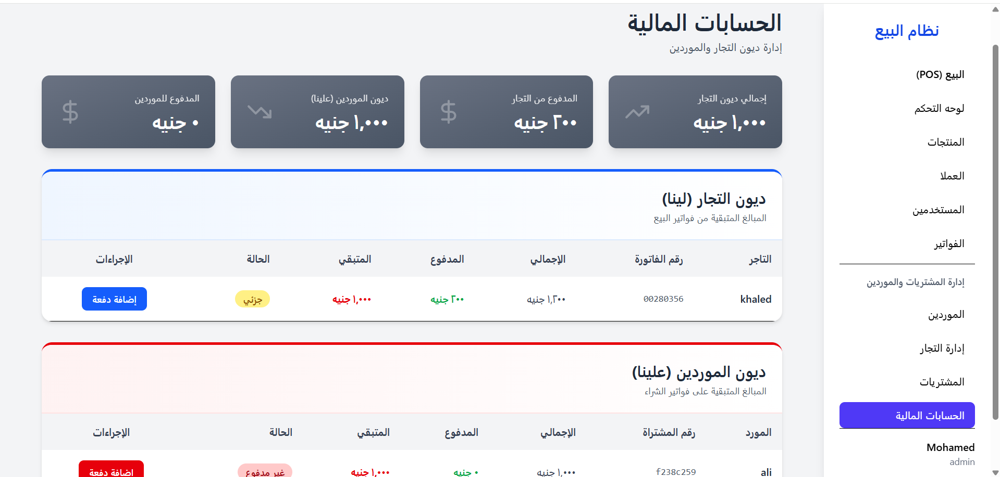
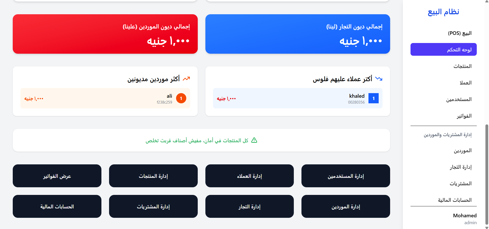
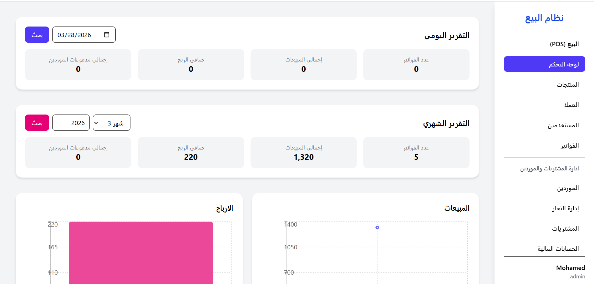
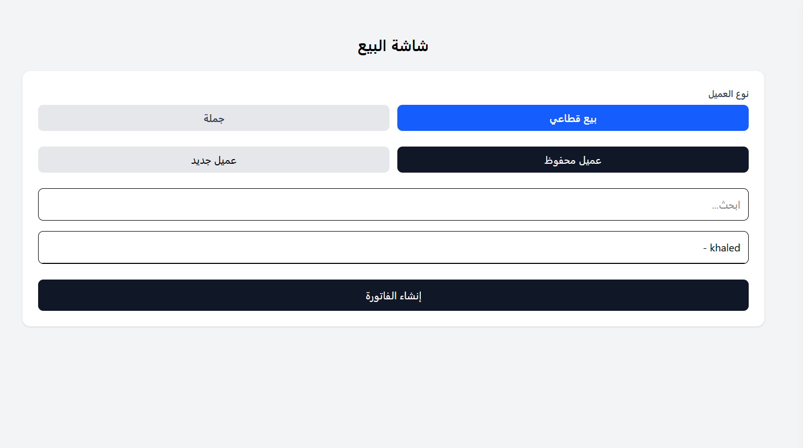
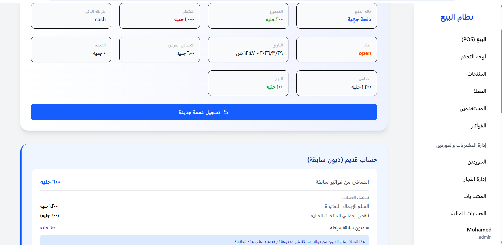
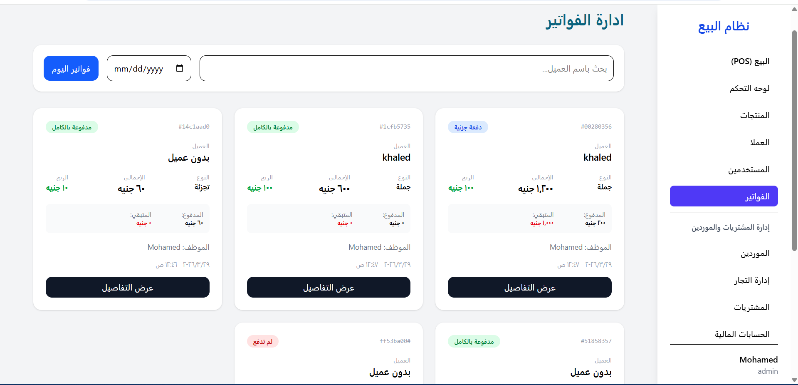
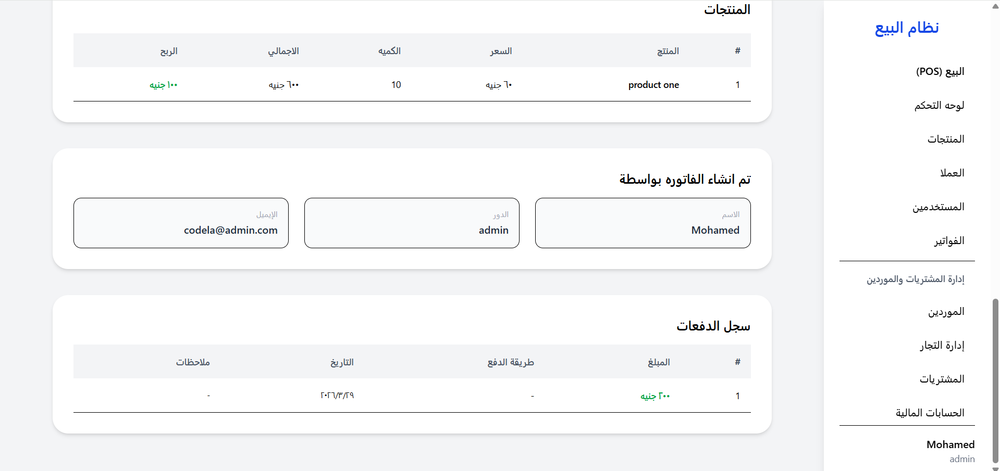
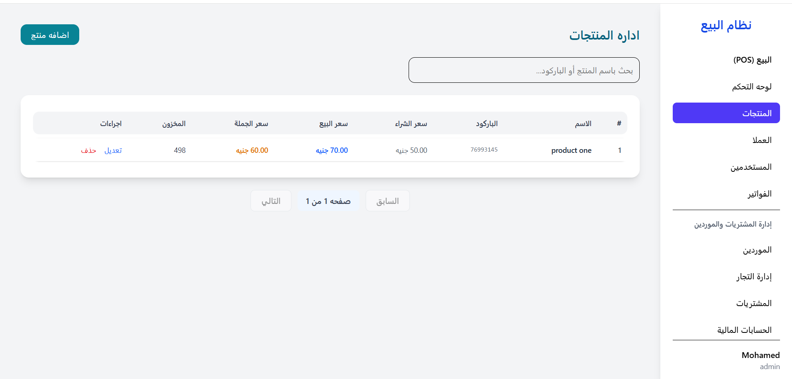
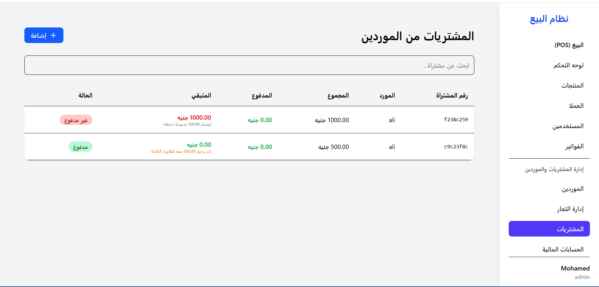

# Enterprise-Grade POS Management System

A robust, production-ready Point of Sale and Financial Management system designed to streamline retail operations, manage complex inventory lifecycles, and provide deep financial insights. 

Built with a modern, decoupled architecture to ensure blazing-fast performance, rock-solid data integrity, and seamless scalability for high-volume daily transactions.

---

## System Architecture
The repository is structured into a modern decoupled architecture:
* `pos_frontend/` - Built with **React.js, Next.js, and Tailwind CSS** for a highly responsive, PWA-enabled client experience.
* `pos-backend/` - Built with **Laravel (PHP) and MySQL** to handle complex business logic, relational data, and secure API endpoints.

> **Note:** This project was developed as a private commercial product for **Codela**. For privacy and NDA compliance, the files included in this repository do not contain the entire source code. They are a partial extraction provided solely to showcase the extensive business logic, system architecture, and UI/UX implementation.

---

## Comprehensive Business Features

### 1. Sales & Operations System
* **High-Speed POS:** Lightning-fast cashier interface optimized for rapid checkout, barcode scanning, and instant invoice generation to minimize customer wait times.
* **Interactive Dashboard:** Real-time analytics, daily/monthly revenue tracking, and graphical representations of business health.
* **Product Management:** Complete CRUD operations for inventory, including variations, stock limits, low-stock alerts, and dynamic pricing tiers.
* **Customer CRM:** Track customer data, purchase history, and loyalty metrics to improve retention.
* **Role-Based Access Control (RBAC):** Granular permission system ensuring strict separation of duties (e.g., Admin vs. Cashier) to secure sensitive financial data.
* **Invoice History:** Comprehensive log of all transactions with abilities to refund, reprint, track payment methods, or export directly to PDF.

### 2. Purchases & Suppliers Management
* **Supplier Portal:** Manage supplier profiles, track shipments, and monitor pending balances and payment histories.
* **Merchants Management:** Dedicated module for handling B2B wholesale merchants and custom pricing agreements.
* **Purchases Tracking:** Automate stock replenishment and log every incoming inventory batch accurately to prevent shrinkage.
* **Financial Accounts:** Advanced ledger system tracking debts, supplier payments, gross revenue, and automatically calculating the exact **Net Profit** after deductions.

---

## Tech Stack & Performance

| Layer | Technology | Key Highlights |
| :--- | :--- | :--- |
| **Frontend** | React.js, Next.js, Tailwind CSS | PWA Support, SSR/SSG for rendering speed, highly responsive UI across all devices. |
| **Backend** | Laravel (PHP) | RESTful APIs, JWT Sanctum Authentication, robust error handling, and secure routing. |
| **Database** | MySQL | Strict relational integrity, highly optimized indexing for fast search queries. |

---

## System Previews

Below is a partial visual walkthrough of the system's core modules and UI/UX implementation. 

### Analytics & Business Intelligence
| Financial Overview | Main Dashboard |
| :---: | :---: |
|  |  |

| Main Dashboard |
| :---: |
|  |

### Point of Sale & Checkout
| (POS) | Invoice Details |
| :---: | :---: |
|  |  |

### Invoice Management & History
| Invoices | Invoice Details |
| :---: | :---: |
|  |  |

### Inventory & Supply Chain
| Product Management | Supplier Portal |
| :---: | :---: |
|  |  |

> **System Notice:** The screenshots above represent only a fraction of the system's capabilities. There are numerous other features, configuration screens, and internal management modules not displayed here to maintain client confidentiality and system security.